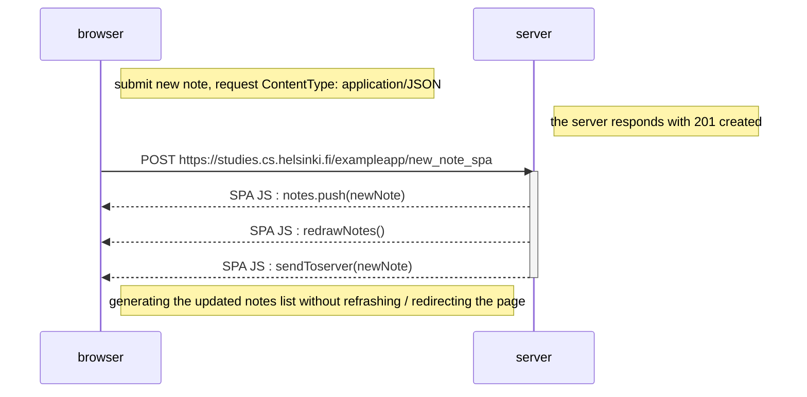

```mermaid

sequenceDiagram
participant browser
participant server

Note right of browser: submit new note, request ContentType: application/JSON 
Note right of server: the server responds with 201 created

browser->>server: POST https://studies.cs.helsinki.fi/exampleapp/new_note_spa
activate server
server-->>browser: SPA JS : notes.push(newNote)
server-->>browser: SPA JS : redrawNotes()
server-->>browser: SPA JS :  sendToserver(newNote)
deactivate server

Note right of browser: generating the updated notes list without refrashing / redirecting the page

```
